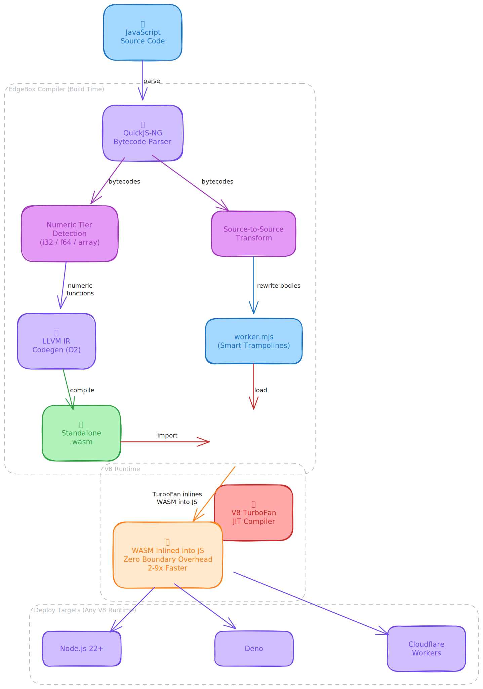

# EdgeBox

**AOT optimizer for V8 JavaScript** — compiles numeric JS kernels to WebAssembly for 2-9x speedups. Ships as a workerd single binary.



## The Problem

V8's JIT compiler is excellent at object-heavy JavaScript (property access, closures, string manipulation), but **leaves performance on the table for compute-intensive numeric code**. Functions like cryptographic hashes, compression kernels, and recursive algorithms run 2-5x slower than they need to because V8's speculative JIT can't fully eliminate dynamic type checks and boxing overhead for tight numeric loops.

Meanwhile, WebAssembly runs numeric code at near-native speed, but the **JS↔WASM boundary** has historically been too expensive for fine-grained function calls. Array data must be copied between JS heap and WASM linear memory on every call.

## Why It Works: V8 TurboFan WASM Inlining

Starting in V8 v12.0 (Chrome 120, Node.js 22+), V8's TurboFan JIT compiler **inlines WebAssembly function calls directly into JavaScript** — the same way it inlines JS→JS calls. This feature is **enabled by default** in all modern V8 runtimes:

```
JavaScript:  result = __wasm.exports.fib(n)
                        │
                        ▼  V8 TurboFan detects WASM call
              Inlines WASM code into JS compilation unit
                        │
                        ▼  Result
              Single native code stream — no boundary overhead
```

This means a JS function that calls `__wasm.exports.fib(n)` compiles to nearly the same machine code as if `fib` were implemented natively. The call frame setup, argument marshaling, and calling convention overhead are **completely eliminated**.

EdgeBox exploits this: it compiles numeric JS functions to WASM exports, then rewrites the JS source with thin trampolines that V8 inlines away. The result is LLVM-optimized numeric code running at full speed inside V8's pipeline.

**Runtime:** workerd (Cloudflare Workers runtime, V8-based). Single binary deployment — no Node.js required.

## The Solution: AOT+JIT Compilation

EdgeBox is a build-time compiler that analyzes your JavaScript, identifies pure numeric functions, compiles them to **standalone WebAssembly**, and rewrites the source with trampolines that V8 inlines at zero cost:

```
JavaScript Source
    ↓  QuickJS bytecode analysis
Automatic numeric tier detection (i32 / f64 / array)
    ↓  LLVM IR codegen → standalone .wasm
Pure numeric kernels compiled to WASM exports
    ↓  Source-to-source transform
JS with function bodies replaced by WASM call trampolines
    ↓  V8 TurboFan (Node.js / Deno / workerd / Chrome)
V8 inlines WASM calls into JS — zero boundary overhead
```

**Key innovations:**
- **Automatic detection**: Analyzes QuickJS bytecodes to identify pure numeric functions (no manual annotation needed)
- **Auto Struct Layout (SOA)**: Detects factory functions that create objects with fixed shapes, rewrites them to allocate fields into contiguous `Int32Array` pools backed by WASM linear memory — enables CPU cache prefetch and SIMD auto-vectorization
- **Provenance tracking**: Traces which arrays are filled from SOA factories, eliminates handle objects entirely at read sites — `nodes[j].kind` becomes a direct typed array access with zero JS object overhead
- **Smart trampolines**: Recursive/cross-calling functions → WASM (deep stacks stay native); pure scalar → keep as JS (V8 already optimal)
- **Zero-copy WASM memory**: `__wasmArray()` allocates TypedArrays directly in WASM linear memory — trampolines detect `arr.buffer === __wbuf` and skip copy entirely
- **Array copy caching**: Read-only array arguments cached by reference identity, eliminating redundant copies in tight loops
- **Cross-function calls**: Two-pass compilation detects functions that call other WASM functions, keeping entire call chains in WASM
- **Real npm packages work**: Tested with pako (zlib compression) and tweetnacl (cryptography)

## Benchmarks

**Overall: 2.56x faster than Node.js** across 40 benchmarks (26 wins, 5 ties, 5 losses, 4 at parity).

### Headline Results (AOT+JIT on Node.js v24)

| Benchmark | AOT+JIT | Node.js | Speedup |
|-----------|:-------:|:-------:|:-------:|
| loop (array sum) | 9 ms | 77 ms | **8.5x faster** |
| arrayStats 100K | 100 ms | 814 ms | **8.1x faster** |
| loop (zero-copy) | 8 ms | 56 ms | **7.0x faster** |
| hanoi(25) | 47 ms | 204 ms | **4.3x faster** |
| ackermann(3,10) | 769 ms | 3,181 ms | **4.1x faster** |
| fib(45) | 2,503 ms | 10,394 ms | **4.1x faster** |
| fib(40) | 653 ms | 2,614 ms | **4.0x faster** |
| adler32 10K | 30 ms | 106 ms | **3.5x faster** |
| magnitudes 100K | 2,181 ms | 7,553 ms | **3.4x faster** |
| dotProductNorm 100K | 289 ms | 866 ms | **2.9x faster** |
| euclideanDist 100K | 293 ms | 838 ms | **2.8x faster** |
| prefixSum 10K | 121 ms | 254 ms | **2.0x faster** |

### Auto Struct Layout (SOA) Results

| Benchmark | AOT+JIT | Node.js | Speedup |
|-----------|:-------:|:-------:|:-------:|
| struct field sum (200K objects) | 10 ms | 21 ms | **2.1x faster** |
| multi-field filter (3 fields/iter) | 19 ms | 27 ms | **1.4x faster** |
| parent chain walk (graph traversal) | 13 ms | 28 ms | **2.2x faster** |
| alloc 2M objects | 52 ms | 132 ms | **2.5x faster** |
| iterate 4M objects 10x | 38 ms | 107 ms | **2.8x faster** |
| iterate 5M (GC pressure) | 38 ms | 56–244 ms | **1.5–6.4x faster** |

SOA advantage grows with scale: at 4M+ objects, V8 heap exceeds L3 cache and GC pauses add unpredictable latency spikes. EdgeBox SOA allocates zero V8 heap objects (raw index return), so performance is predictable regardless of heap size.

SOA transforms factory-allocated objects into contiguous typed arrays in WASM linear memory. No code changes needed — EdgeBox detects the pattern automatically:

```javascript
// Your code (unchanged)
function makeNode(kind, flags, id) {
  return { kind: kind, flags: flags, id: id };
}
var nodes = [];
for (var i = 0; i < 200000; i++) {
  nodes.push(makeNode(i % 16, i * 7 & 255, i));
}
// This loop runs 2.1x faster — fields are in contiguous WASM memory
for (var j = 0; j < nodes.length; j++) {
  sum += nodes[j].kind;
}
```

### Real-World: TypeScript Compiler (TSC)

EdgeBox compiles the TypeScript compiler (`_tsc.js`, 130K+ lines) with 8 numeric WASM kernels. No code changes to TSC — just `edgebox _tsc.js`.

```bash
# Compile + pack
edgebox _tsc.js
edgebox pack zig-out/bin/_tsc.js/    # → standalone workerd binary (121MB)
```

Diagnostic output matches Node.js `tsc` exactly across all test projects (CI-verified).

### Where It Excels vs Where It Doesn't

| Code Pattern | Speedup | Why |
|--------------|:-------:|-----|
| Array iteration loops | **7-9x** | WASM eliminates bounds checks, V8 inlines the trampoline |
| Recursive functions (fib, ackermann) | **4-5x** | Entire call stack stays in WASM, zero JS overhead |
| Numeric kernels (hash, CRC, crypto) | **2-4x** | WASM eliminates type checks, array caching skips copies |
| Struct field iteration (SOA) | **2-3x** | Fields in contiguous WASM memory, zero GC pressure at scale |
| Float64 compute (dot product, distance) | **3x** | LLVM optimizes f64 loops better than V8's speculative JIT |
| Pure integer bitwise (rotr, popcount) | ~same | V8 JIT already compiles these to native integer ops |
| Object-heavy code | No benefit | V8 JIT already optimal for property access and closures |

## Quick Start

```bash
# Install
zig build cli        # Build native compiler
npm install workerd  # For single binary packing

# Compile
npx edgebox my-app.js

# Output:
#   zig-out/bin/my-app.js/my-app-worker.mjs        — Worker module (V8 JIT + WASM AOT)
#   zig-out/bin/my-app.js/my-app-standalone.wasm    — WASM numeric kernels
#   zig-out/bin/my-app.js/my-app-config.capnp       — workerd configuration

# Run (pick one)
npx workerd serve zig-out/bin/my-app.js/my-app-config.capnp   # workerd
./zig-out/bin/my-app.js/my-app-workerd                         # single binary

# Pack into single binary (workerd + V8 embedded)
npx edgebox pack zig-out/bin/my-app.js/

# Run benchmarks
bash bench/run_all.sh
```

### Zero-Copy Arrays

For maximum performance, allocate arrays directly in WASM memory:

```javascript
// In your source code — check if __wasmArray is available (AOT+JIT path)
var data;
if (typeof __wasmArray === 'function') {
    data = __wasmArray(Int32Array, 100000);  // Allocated in WASM memory
} else {
    data = new Int32Array(100000);            // Normal allocation
}
// When data lives in WASM memory, trampolines skip copy entirely
result = sumArray(data);  // Zero overhead — direct WASM pointer
```

## How It Works

### 1. Bytecode Analysis

EdgeBox parses JavaScript with QuickJS-NG, then analyzes each function's bytecodes to determine if it's pure numeric:

| Tier | Detection | WASM Signature | Examples |
|------|-----------|----------------|----------|
| **i32** | Only arithmetic, bitwise, comparisons, locals, control flow | `(i32, i32) → i32` | `fib`, `gcd`, `isPrime` |
| **f64** | Uses division without bitwise (float semantics) | `(f64, f64) → f64` | `mandelbrot`, `lerp` |
| **i32+array** | Pure numeric + array element access | `(i32, i32_ptr, i32) → i32` | `adler32`, `crc32` |
| **f64+array** | Float numeric + array access | `(f64, f64_ptr, f64) → f64` | `dotProductNorm`, `euclideanDist` |

Functions that use objects, strings, closures, or other non-numeric patterns are left as JavaScript for V8's JIT.

### 2. LLVM Codegen → Standalone WASM

Numeric functions are compiled through LLVM to a standalone `.wasm` binary:
- **Cross-function calls resolved**: Two-pass compilation with forward declarations
- **Constant pool**: QuickJS `push_const` values resolved at compile time
- **Math intrinsics**: `Math.sqrt`, `Math.abs`, `Math.floor` → WASM f64 intrinsics
- **Up to 24 parameters**: Supports functions with many scalar arguments
- **O3 optimization**: LLVM auto-vectorization for array loops
- **WASM SIMD**: `i32x4`/`f64x2` vector instructions (auto-vectorized by LLVM)

### 3. Source-to-Source Transform

The original JavaScript is rewritten with function bodies replaced by WASM call trampolines:

```javascript
// Original
function adler32(adler, buf, len, pos) {
  /* 30 lines of bit manipulation */
}

// Transformed (auto-generated)
function adler32(adler, buf, len, pos) {
  if (buf.buffer === __wbuf) return __wasm.exports.adler32(adler, buf.byteOffset, len, pos);
  const __sp0 = __wasmStackSave();
  const __p1 = __wasmStackAlloc(buf.length << 2);
  if (__last_fn !== 0 || buf.length < 128 || buf !== __c0_1) {
    __m.set(buf, __p1 >> 2); __c0_1 = buf;
  }
  __last_fn = 0;
  const __r = __wasm.exports.adler32(adler, __p1, len, pos);
  __wasmStackRestore(__sp0);
  return __r;
}
```

V8 TurboFan sees the `__wasm.exports.adler32(...)` call and inlines the WASM code directly — the trampoline's copy-or-skip logic and the WASM compute kernel compile into a single native code stream. The stack allocator (`__wasmStackSave`/`__wasmStackRestore`) scopes temporary copies to each trampoline call — nested calls and multiple scopes work correctly with LIFO lifetime management.

### 4. Auto Struct Layout (SOA Transform)

EdgeBox detects factory functions that create objects with fixed shapes (e.g., `return { kind, flags, id }`) and rewrites them to store fields in contiguous `Int32Array` pools backed by WASM linear memory:

```javascript
// Original                              // Transformed (auto-generated)
function makeNode(kind, flags, id) {     function makeNode(kind, flags, id) {
  return { kind, flags, id };              const __idx = __soa_0_next++;
}                                          __soa_0_kind[__idx] = kind;
                                           __soa_0_flags[__idx] = flags;
                                           __soa_0_id[__idx] = id;
                                           return __idx;  // raw integer, zero GC
                                         }
```

**Provenance tracking** then transforms read sites — `nodes[j].kind` becomes `__soa_0_kind[base + j]`, a direct TypedArray load:

| Optimization Layer | What It Does |
|-------------------|--------------|
| SOA allocation | Fields stored in contiguous `Int32Array` (WASM linear memory) |
| Provenance tracking | Detects arrays filled from SOA factories via `.push()` |
| Index alignment | `nodes[j].kind` → `__soa_0_kind[base + j]` (eliminates handle objects) |
| Raw index return | Factory returns integer, not object — zero V8 heap allocation |
| Recursive transform | `nodes[nodes[j].parentId].kind` → chained typed array lookups |

### 5. Smart Trampoline Decisions

| Function Pattern | Decision | Rationale |
|-----------------|----------|-----------|
| Recursive (calls itself) | **WASM trampoline** | Entire call stack in WASM, no JS↔WASM boundary per recursion |
| Cross-caller (calls other WASM functions) | **WASM trampoline** | Inter-function calls stay in WASM |
| Array + loop + compute | **WASM trampoline + cache** | Identity cache amortizes copy cost |
| Write-only heavy (loop ≥50 instrs) | **WASM trampoline** | No copy-in needed, only copy-back |
| Offset-indexed multi-array (≥2 arrays + ≥2 scalars) | **Keep as JS** | Offset-based access into small fixed regions, copy dominates |
| Write-only light (<50 instrs) | **Keep as JS** | V8 handles write loops perfectly |
| Pure scalar, non-recursive (<150 instrs) | **Keep as JS** | V8 JIT inlines these perfectly |

## Build Requirements

- **Zig 0.15+** — Build system
- **LLVM 20** — Only system dependency (for WASM codegen)

```bash
# macOS
brew install zig llvm@20

# Ubuntu/Debian
curl -fsSL https://ziglang.org/download/0.15.2/zig-linux-x86_64-0.15.2.tar.xz | tar -xJ
sudo apt-get install llvm-20 llvm-20-dev

# Build
zig build cli
```

## License

Apache License 2.0

**Vendored dependencies:**
- QuickJS-NG: MIT License
